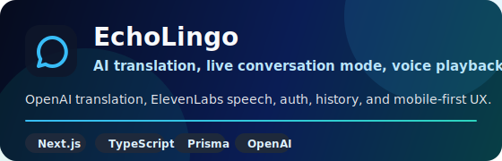
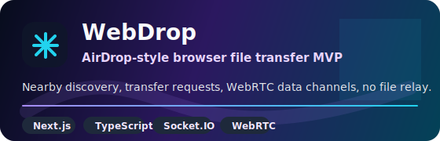
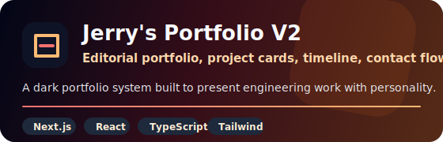
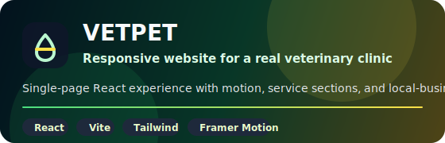
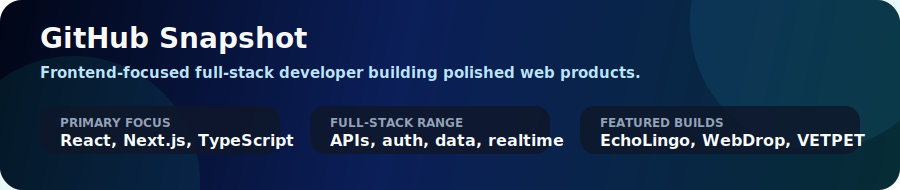

<!--
Visual credits:
- capsule-render: https://github.com/kyechan99/capsule-render
- readme-typing-svg: https://github.com/DenverCoder1/readme-typing-svg
- skill-icons: https://github.com/tandpfun/skill-icons
- project cards: repo-hosted SVGs in ./assets for reliable GitHub rendering
-->

  

  

  
  
  

## About

I am a full-stack developer who leans frontend. I build responsive, accessible, and maintainable web applications with polished interfaces, practical backend systems, and strong product sense.

My favorite work sits where UI quality meets real engineering: component architecture, clean data flows, API integration, authentication, performance, and documentation that makes a project easy to understand.

## Toolbox

  

| Frontend | Backend | Product Engineering |
| --- | --- | --- |
| React, Next.js, TypeScript, Tailwind CSS, Vite | Node.js, Express, PostgreSQL, Prisma, Supabase | Accessibility, responsive UI, API design, auth, performance, docs |

## Featured Builds

  
  

  
  

### Project Notes

| Project | Focus | Stack |
| --- | --- | --- |
| [EchoLingo](https://github.com/LJebry/EchoLingo) | Mobile-first translation app with guest translation, two-speaker conversation mode, Google sign-in, saved history, OpenAI translation, and ElevenLabs voice playback. | Next.js, React, TypeScript, Prisma, PostgreSQL, OpenAI, ElevenLabs |
| [WebDrop](https://github.com/LJebry/WebDrop) | Browser-to-browser file transfer MVP with nearby discovery, Socket.IO signaling, and direct WebRTC data channel transfers. | Next.js, TypeScript, Node.js, Express, Socket.IO, WebRTC |
| [Jerry's Portfolio V2](https://github.com/LJebry/jerrys-portfolio-v2) | Personal developer portfolio with a cinematic landing page, project cards, experience timeline, contact flow, and a daily Wordle-style page. | Next.js, React, TypeScript, Tailwind CSS |
| [VETPET](https://github.com/LJebry/VETPET) | Responsive veterinary clinic website built as a polished single-page application for a real local business. | React, Vite, Tailwind CSS, Framer Motion, GSAP |

## How I Work

- Start with the user flow, then shape the component and data model around it.
- Keep code readable, documented where it matters, and easy to extend.
- Build interfaces that are responsive, accessible, and polished enough to ship.
- Treat backend, deployment, and documentation as part of the product experience.

## GitHub Snapshot

  

## Contact

I am open to frontend-focused full-stack roles, collaboration on web products, and projects where user experience and engineering quality both matter.

- GitHub: [github.com/LJebry](https://github.com/LJebry)
- Portfolio source: [LJebry/jerrys-portfolio-v2](https://github.com/LJebry/jerrys-portfolio-v2)

  

  Visuals powered by open-source README projects: <a href="https://github.com/kyechan99/capsule-render">capsule-render</a>, <a href="https://github.com/DenverCoder1/readme-typing-svg">readme-typing-svg</a>, and <a href="https://github.com/tandpfun/skill-icons">skill-icons</a>. Project cards are repo-hosted SVGs for reliable rendering.

